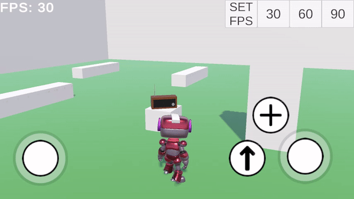
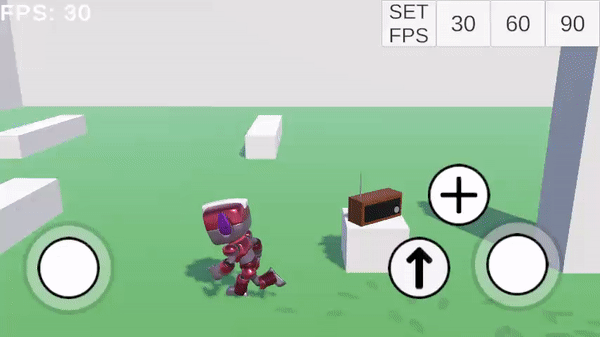
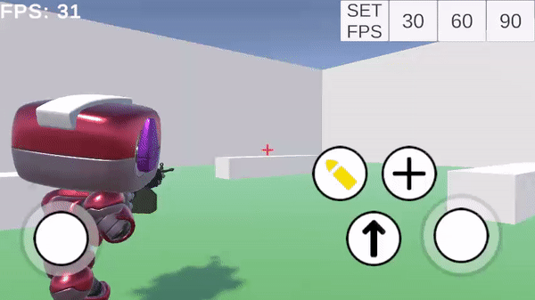
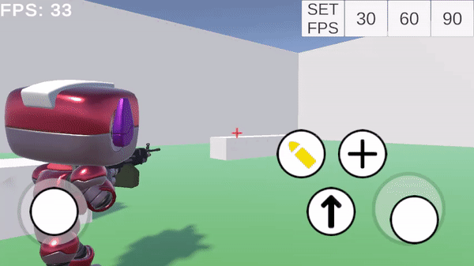

### sunday-test-task-2

Имплементация второго тестового задания. Был выбран вариант с гуманоидной анимацией.

Использовались Cinemachine, Animation Rigging, Input System.

Дополнительно был добавлен DOTween и SafeAreaHelper.

Мой код (не ассетовый) находится в папке **Assets/Project/Scripts**.

Showcase (гифки, возможно грузятся долго):

